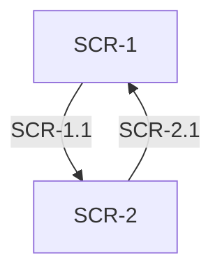
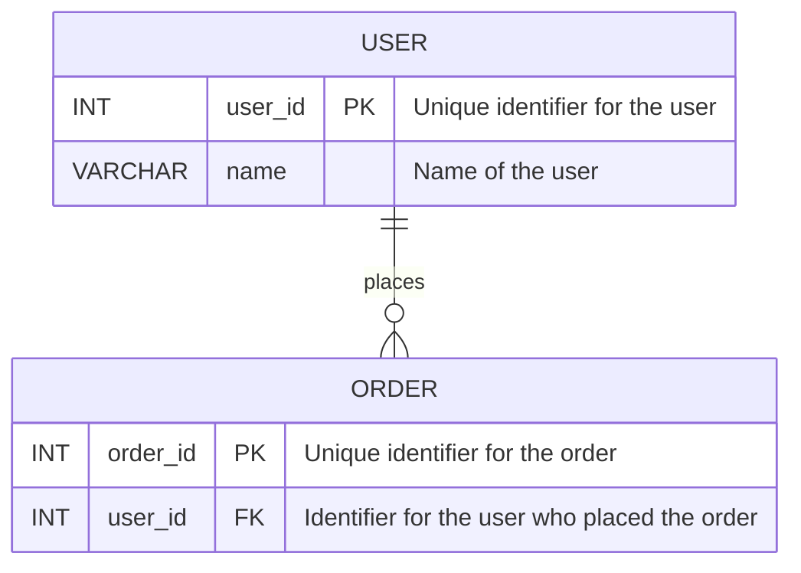

* Write an external design document based on the given feature name by user input into `docs/specs/<feature-name>/external-design.md`.
* Before writing the document, you MUST check if the requirement specifications file `docs/specs/<feature-name>/requirements.md` exists.
  * If the file does not exist, respond with: ``Error: Requirement specifications not found for <feature-name>. Try `/init-requirement <feature-name>` first.``
* Follow the template below for the external design document:

````markdown
# 外部設計書

{{Note: Write only the necessary sections based on the requirements specified in requirements.md. If certain sections are not applicable, you may omit them.}}

## 画面設計

### SCR-1: {{First screen title}}

| イベントID | 条件 | 挙動 | 要件ID | 備考 |
|--------|------|------|--------|------|
| SCR-1.1 | {{Condition: e.g., User clicks on 'Submit' button}} | {{Behavior: e.g., Display confirmation dialog}} | {{Related Requirement ID(s): One or more relevant requirement IDs from requirements.md. e.g., REQ-1.1, REQ-2.3}} | {{Additional notes if any.}} |
| SCR-1.2 | {{Condition}} | {{Behavior}} | {{Related Requirement ID(s)}} | {{Additional notes if any.}} |

### SCR-2: {{Second screen title}}

{{Repeat the table structure as above for additional screens.}}

## 画面遷移図

{{Describe the screen transition diagram here in Mermaid syntax. For example:}}



## API設計

### API-1: {{First API endpoint title}}

| インタフェースID | メソッド | エンドポイント | パラメータ | レスポンス | 要件ID | 備考 |
|--------|----------|----------------|------------|------------|--------|------|
| API-1.1 | {{Method: e.g., GET, POST}} | {{Endpoint: e.g., /api/v1/resource}} | {{Parameters: e.g., id (string, required), name (string, optional)}} | {{Response: e.g., 200 OK with JSON body}} | {{Related Requirement ID(s): One or more relevant requirement IDs from requirements.md. e.g., REQ-1.1, REQ-2.3}} | {{Additional notes if any.}} |
| API-1.2 | {{Method}} | {{Endpoint}} | {{Parameters}} | | {{Response}} | {{Related Requirement ID(s)}} | {{Additional notes if any.}} |

### API-2: {{Second API endpoint title}}

{{Repeat the table structure as above for additional API endpoints.}}

## データ設計

### DB-1: {{First database table title}}

| カラム名 | データ型 | 制約 | 説明 | 要件ID | 備考 |
|--------|----------|------|------|--------|------|
| {{Column Name: e.g., user_id}} | {{Data Type: e.g., INT, VARCHAR(255)}} | {{Constraints: e.g., PRIMARY KEY, NOT NULL}} | | {{Description: e.g., Unique identifier for the user}} | {{Related Requirement ID(s): One or more relevant requirement IDs from requirements.md. e.g., REQ-1.1, REQ-2.3}} | {{Additional notes if any.}} |
| {{Column Name}} | {{Data Type}} | {{Constraints}} | {{Description}} | {{Related Requirement ID(s)}} | {{Additional notes if any.}} |

### DB-2: {{Second database table title}}

{{Repeat the table structure as above for additional database tables.}}

## ER図

{{Describe the ER diagram here in Mermaid syntax. For example:}}



## その他設計事項

{{Include any other design considerations or notes here as necessary.}}
````
