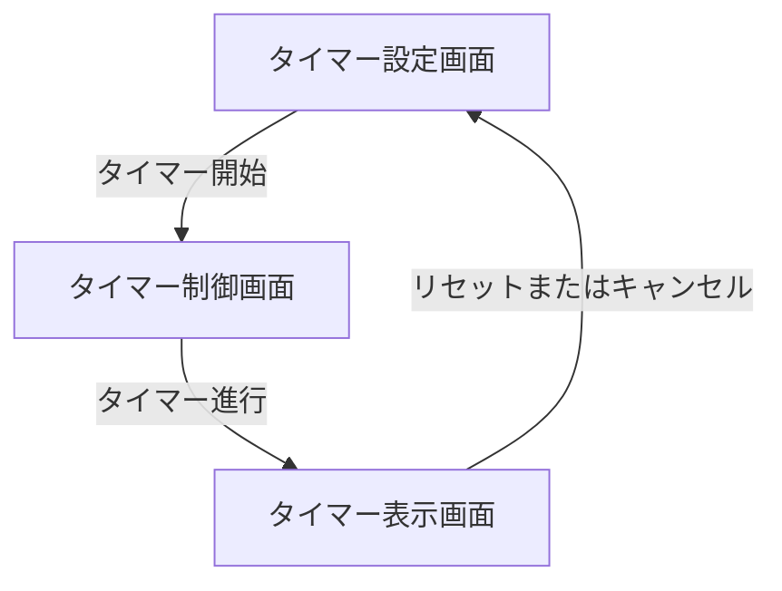
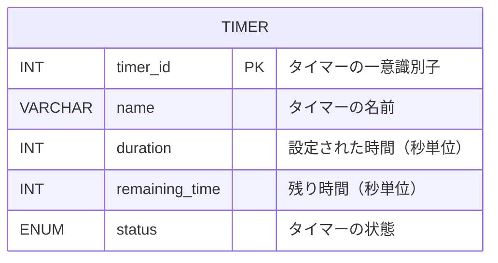

# 外部設計書

## 画面設計

### SCR-1: タイマー設定画面

| イベントID | 条件 | 挙動 | 要件ID | 備考 |
|--------|------|------|--------|------|
| SCR-1.1 | ユーザーが時、分、秒を入力する | 入力値を検証し、タイマーを設定する | REQ-1.1 | 最大値を超えた場合はエラー表示 |
| SCR-1.2 | ユーザーがプリセットを選択する | プリセット値をタイマーに設定する | REQ-1.2 | |
| SCR-1.3 | ユーザーがタイマーに名前を入力する | 名前を保存する | REQ-1.3 | |

### SCR-2: タイマー制御画面

| イベントID | 条件 | 挙動 | 要件ID | 備考 |
|--------|------|------|--------|------|
| SCR-2.1 | ユーザーが「開始」ボタンを押す | タイマーを開始する | REQ-2.1 | |
| SCR-2.2 | ユーザーが「一時停止」ボタンを押す | タイマーを一時停止する | REQ-2.2 | |
| SCR-2.3 | ユーザーが「再開」ボタンを押す | タイマーを再開する | REQ-2.3 | |
| SCR-2.4 | ユーザーが「リセット」ボタンを押す | タイマーを初期値に戻す | REQ-2.4 | |
| SCR-2.5 | ユーザーが「キャンセル」ボタンを押す | タイマーをキャンセルする | REQ-2.5 | |

### SCR-3: タイマー表示画面

| イベントID | 条件 | 挙動 | 要件ID | 備考 |
|--------|------|------|--------|------|
| SCR-3.1 | タイマーが進行中 | 残り時間を時:分:秒形式で表示する | REQ-3.1 | |
| SCR-3.2 | タイマーが進行中 | プログレスバーで進行状況を表示する | REQ-3.2 | |
| SCR-3.3 | 残り時間が1分未満 | 表示色を赤色に変更する | REQ-3.3 | |

## 画面遷移図

## API設計

### API-1: タイマー操作API

| インタフェースID | メソッド | エンドポイント | パラメータ | レスポンス | 要件ID | 備考 |
|--------|----------|----------------|------------|------------|--------|------|
| API-1.1 | POST | /api/timer/start | duration (int, required) | 200 OK | REQ-2.1 | タイマー開始 |
| API-1.2 | POST | /api/timer/pause | timer_id (int, required) | 200 OK | REQ-2.2 | タイマー一時停止 |
| API-1.3 | POST | /api/timer/resume | timer_id (int, required) | 200 OK | REQ-2.3 | タイマー再開 |
| API-1.4 | POST | /api/timer/reset | timer_id (int, required) | 200 OK | REQ-2.4 | タイマーリセット |
| API-1.5 | DELETE | /api/timer/cancel | timer_id (int, required) | 200 OK | REQ-2.5 | タイマーキャンセル |

## データ設計

### DB-1: タイマー情報テーブル

| カラム名 | データ型 | 制約 | 説明 | 要件ID | 備考 |
|--------|----------|------|------|--------|------|
| timer_id | INT | PRIMARY KEY | タイマーの一意識別子 | REQ-2.1 | |
| name | VARCHAR(255) | NOT NULL | タイマーの名前 | REQ-1.3 | |
| duration | INT | NOT NULL | 設定された時間（秒単位） | REQ-1.1 | |
| remaining_time | INT | NOT NULL | 残り時間（秒単位） | REQ-3.1 | |
| status | ENUM('running', 'paused', 'stopped') | NOT NULL | タイマーの状態 | REQ-2.1, REQ-2.2, REQ-2.5 | |

## ER図

## その他設計事項

* タイマー終了時の通知音はユーザーが選択可能
* タイマーの状態はローカルストレージに保存し、ページリロード時に復元可能
