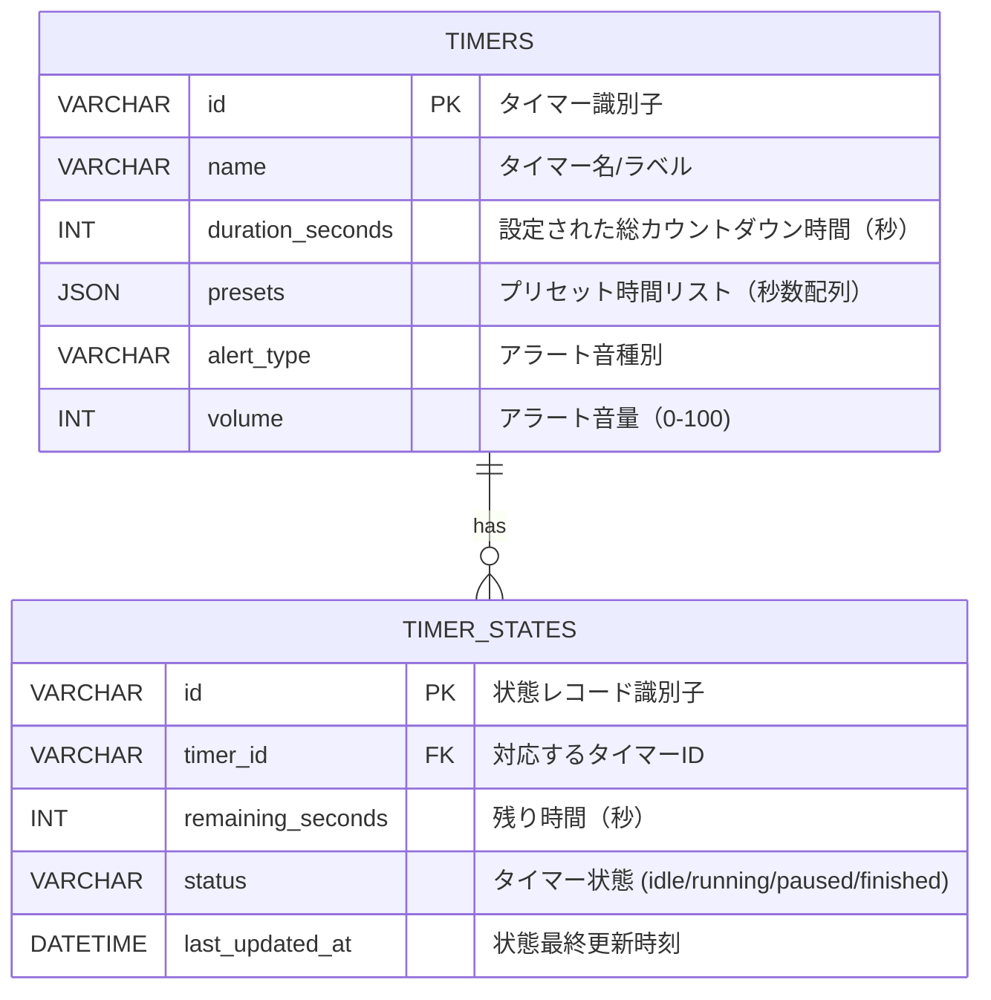

# 外部設計書

## 画面設計

### SCR-1: カウントダウンタイマー画面

単一画面でタイマーの設定・制御・表示・通知を行う。複数タイマー対応は将来拡張とし、本バージョンでは1つのタイマーを扱う前提とする。

| イベントID | 条件 | 挙動 | 要件ID | 備考 |
|--------|------|------|--------|------|
| SCR-1.1 | 画面初期表示時 | タイマーが停止状態で、時間は「00:00:00」を表示する。開始ボタン以外の制御ボタン（一時停止、再開、リセット、キャンセル）は非活性表示とする。 | REQ-2.1, REQ-2.2, REQ-2.4, REQ-2.5, REQ-3.1 | 初期状態の明確化 |
| SCR-1.2 | ユーザーが時・分・秒入力フィールドを編集したとき | 入力値に応じて内部的なカウントダウン時間を更新し、表示も「時:分:秒」形式で反映する。 | REQ-1.1, REQ-3.1, NFR-2.2 | 入力バリデーション（最大99:59:59、0未満は禁止）を行う |
| SCR-1.3 | ユーザーがプリセット時間ボタン（例: 5分/10分/25分）を押下 | 対応する時間を入力フィールドおよび表示に設定する。 | REQ-1.2, REQ-3.1 | プリセットは画面上にボタンで配置 |
| SCR-1.4 | ユーザーがタイマー名/ラベル入力フィールドを編集 | 入力された文字列をタイマー名として保存し、画面上部に表示する。 | REQ-1.3 | 空の場合は「タイマー」などのデフォルト名を表示 |
| SCR-1.5 | ユーザーが「開始」ボタンを押下（設定時間 > 0 の場合） | カウントダウンを開始し、残り時間表示を1秒ごとに更新する。開始ボタンは非活性、一時停止・リセット・キャンセルボタンを活性化する。 | REQ-2.1, REQ-2.2, REQ-2.4, REQ-2.5, REQ-3.1, NFR-1.1, NFR-1.2 | 0秒の場合はエラー表示または操作無効化で対応 |
| SCR-1.6 | タイマー進行中 | プログレスバーや円形インジケータで経過/残り割合を表示する。 | REQ-3.2, NFR-2.1 | 合計時間に対する進捗率で描画 |
| SCR-1.7 | 残り時間がしきい値（例: 1分）以下になったとき | 残り時間表示およびプログレスインジケータの色を警告色（例: 赤）に変更する。 | REQ-3.3 | しきい値は固定値または設定で変更可能（将来拡張） |
| SCR-1.8 | ユーザーが「一時停止」ボタンを押下（タイマー進行中） | カウントダウンを停止し、残り時間表示を保持する。「再開」ボタンを活性化し、「一時停止」ボタンを非活性にする。 | REQ-2.2, REQ-2.3 | 停止中も残り時間とプログレス表示は維持 |
| SCR-1.9 | ユーザーが「再開」ボタンを押下（一時停止中） | 一時停止時点の残り時間からカウントダウンを再開する。「再開」ボタンを非活性、「一時停止」ボタンを活性にする。 | REQ-2.3 | |
| SCR-1.10 | ユーザーが「リセット」ボタンを押下（タイマー進行中または一時停止中） | カウントダウンを停止し、表示時間を初期設定値に戻す。一時停止・再開ボタンは非活性とする。 | REQ-2.4, REQ-3.1 | 初期値は最後に設定した時間またはプリセット |
| SCR-1.11 | ユーザーが「キャンセル」ボタンを押下（タイマー進行中または一時停止中） | カウントダウンを停止し、表示時間を「00:00:00」に戻す。タイマー名は維持するか空に戻す仕様とする。 | REQ-2.5, REQ-3.1 | 再利用せず破棄する想定 |
| SCR-1.12 | タイマーが0秒に到達したとき | カウントダウンを停止し、残り時間表示を「00:00:00」で固定する。音声アラートを再生し、画面上部に通知メッセージを表示する。 | REQ-3.1, REQ-4.1, REQ-4.2, NFR-1.1, NFR-1.2 | アラート停止操作が行われるまで音声を継続または一定回数再生 |
| SCR-1.13 | タイマー終了時、音声アラート再生中にユーザーが「アラート停止」ボタンまたは同等のUIを押下 | 音声アラートを停止し、通知メッセージは一定時間後に自動で非表示、またはユーザー操作で閉じられる。 | REQ-4.3, NFR-2.1 | |
| SCR-1.14 | ユーザーが「アラート音選択」UIで別の音を選択 | 選択されたアラート音を設定として保存し、次回以降のタイマー終了時に適用する。 | REQ-4.4, NFR-2.2 | プレビュー再生機能は将来拡張 |
| SCR-1.15 | ユーザーが「音量スライダー」を操作 | 設定された音量でアラート音を再生するように内部設定を更新する。 | REQ-4.5, NFR-2.2 | 即時プレビューを行うかは要検討 |
| SCR-1.16 | ユーザーがキーボードショートカット（例: Space=開始/一時停止、R=リセット）を入力 | 対応するボタン押下と同等の挙動を行う。 | NFR-2.3, REQ-2.1, REQ-2.2, REQ-2.4 | フォーカス状態によるショートカット有効範囲を定義 |
| SCR-1.17 | ブラウザタブを切り替えた/非アクティブにした | タイマーは継続してカウントダウンし、タブ復帰後も正しい残り時間を表示する。 | NFR-4.1, NFR-1.1 | バックグラウンド時の処理精度は実装側で担保 |
| SCR-1.18 | ページをリロードした（タイマー未終了の場合） | リロード前のタイマー状態（残り時間、進行/一時停止状態、タイマー名、アラート設定）を復元し、継続または停止状態を再現する。 | NFR-4.2, NFR-4.1 | ローカルストレージ等を利用した状態復元 |
| SCR-1.19 | ページをリロードした（タイマー終了後） | 最新の状態（終了済み・残り時間0）を表示する。アラート音は再生しないが、必要に応じて「前回終了時刻」などを表示する。 | NFR-4.2 | |
| SCR-1.20 | サポート対象ブラウザ/デバイスで画面を表示 | レイアウトが崩れず、主要操作が利用可能な状態で表示される。 | NFR-3.1, NFR-3.2, NFR-2.2 | レスポンシブデザイン（PC/タブレット/スマホ）を想定 |

## 画面遷移図

本機能は単一画面で完結するため、画面遷移はシンプルな状態遷移として表現する。

```mermaid
stateDiagram-v2
    [*] --> IDLE

    state IDLE {
        [*] --> Ready
        Ready --> Running: 開始
    }

    state RUNNING as Running
    state PAUSED as Paused
    state FINISHED as Finished

    Running --> Paused: 一時停止
    Paused --> Running: 再開

    Running --> Finished: 時間到達
    Paused --> Finished: 時間到達

    Running --> IDLE: リセット/キャンセル
    Paused --> IDLE: リセット/キャンセル
    Finished --> IDLE: リセット/キャンセル
```

## API設計

現時点ではブラウザ内で完結するクライアントサイド実装を前提とし、サーバーサイドAPIは必須ではない。そのため、本外部設計では汎用的なローカル状態管理を前提とし、サーバーAPIが必要になった際に別途API設計を追加する。

将来的にサーバー永続化などを行う場合の参考として、例示的なAPI案を以下に示す。

### API-1: タイマー設定永続化API（将来拡張）

| インタフェースID | メソッド | エンドポイント | パラメータ | レスポンス | 要件ID | 備考 |
|--------|----------|----------------|------------|------------|--------|------|
| API-1.1 | POST | /api/v1/timers | name (string), durationSeconds (number), presets (array), alertType (string), volume (number) | 201 Created, 作成されたタイマー設定情報 | REQ-1.1, REQ-1.2, REQ-1.3, REQ-4.4, REQ-4.5 | 永続化が必要になった場合に利用 |

### API-2: タイマー状態復元API（将来拡張）

| インタフェースID | メソッド | エンドポイント | パラメータ | レスポンス | 要件ID | 備考 |
|--------|----------|----------------|------------|------------|--------|------|
| API-2.1 | GET | /api/v1/timers/{id}/state | id (string) | 200 OK, 現在の残り時間・状態 | NFR-4.2 | クライアント間で状態共有が必要な場合 |

## データ設計

本バージョンではブラウザのローカルストレージなどを用いたクライアントローカルのデータ保持を前提とし、RDBMS等のサーバーDBテーブルは必須としない。将来、ユーザー毎にタイマー設定や履歴を永続化する場合の想定スキーマ例を示す。

### DB-1: timers（タイマー設定）

| カラム名 | データ型 | 制約 | 説明 | 要件ID | 備考 |
|--------|----------|------|------|--------|------|
| id | VARCHAR(36) | PRIMARY KEY, NOT NULL | タイマー識別子 | REQ-1.3 | UUID等 |
| name | VARCHAR(255) | NOT NULL | タイマー名/ラベル | REQ-1.3 | |
| duration_seconds | INT | NOT NULL | 設定された総カウントダウン時間（秒） | REQ-1.1 | 最大 359999 (99:59:59) |
| presets | JSON | NULL | プリセット時間リスト（秒数配列） | REQ-1.2 | 例: [300, 600, 1500] |
| alert_type | VARCHAR(50) | NOT NULL | アラート音種別 | REQ-4.4 | |
| volume | INT | NOT NULL | アラート音量（0-100） | REQ-4.5 | |

### DB-2: timer_states（タイマー状態）

| カラム名 | データ型 | 制約 | 説明 | 要件ID | 備考 |
|--------|----------|------|------|--------|------|
| id | VARCHAR(36) | PRIMARY KEY, NOT NULL | 状態レコード識別子 | NFR-4.2 | |
| timer_id | VARCHAR(36) | NOT NULL | 対応するタイマーID | NFR-4.2 | timers.id への外部キー |
| remaining_seconds | INT | NOT NULL | 残り時間（秒） | NFR-4.2, NFR-4.1, NFR-1.1 | |
| status | VARCHAR(20) | NOT NULL | タイマー状態（idle/running/paused/finished） | NFR-4.1 | |
| last_updated_at | DATETIME | NOT NULL | 状態最終更新時刻 | NFR-4.1 | ページリロード時の復元に利用 |

## ER図

将来のサーバーサイド永続化を想定したER図例を以下に示す。



## その他設計事項

- UIコンポーネント
  - 時間入力: 時・分・秒それぞれ独立した数値入力フィールド（スピンボックスまたはセレクト）
  - 制御ボタン: 開始、一時停止、再開、リセット、キャンセル、アラート停止
  - 表示: 残り時間テキスト表示、プログレスバー/円形インジケータ、タイマー名表示
  - 通知: 画面上部または中央にアラートメッセージ領域を配置
- キーボードショートカット（例）
  - Space: 開始/一時停止トグル
  - R: リセット
  - C: キャンセル
- 互換性
  - 最新の主要ブラウザ（Chrome, Firefox, Safari, Edge）の現行サポートバージョンを対象とする。
  - レスポンシブレイアウトにより、スマートフォン縦画面でも主要機能が利用可能なUIとする。
- アクセシビリティ
  - 主要な操作ボタンおよび入力フィールドは、タッチ操作でも押しやすいサイズ（推奨44px以上）を確保する。
  - 色覚多様性に配慮し、警告色のみで状態を示さず、テキストやアイコンも併用する（将来拡張含む）。
