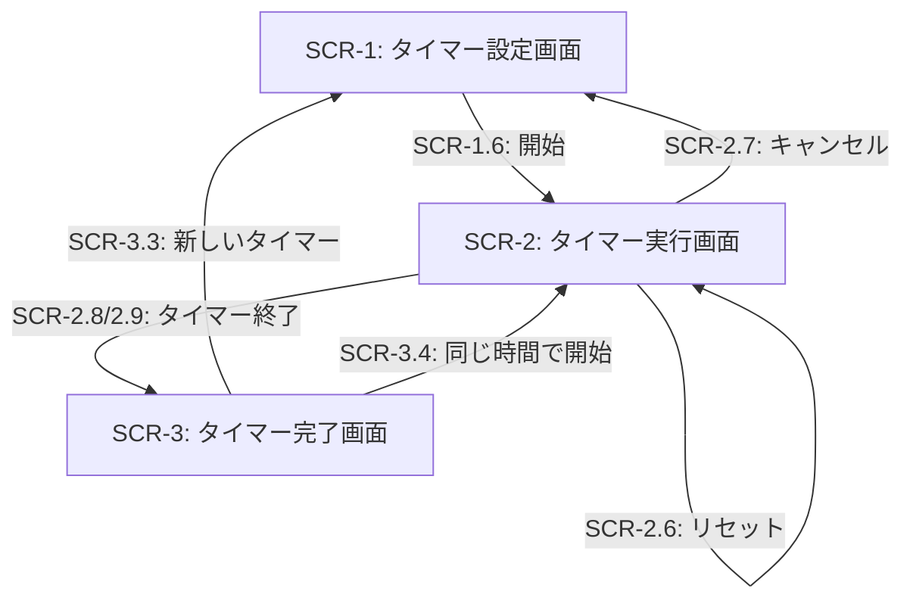
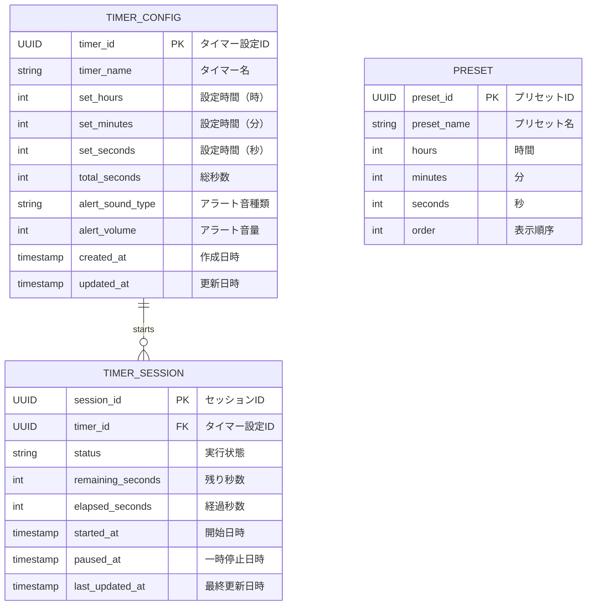

# 外部設計書

## 画面設計

### SCR-1: タイマー設定画面

| イベントID | 条件 | 挙動 | 要件ID | 備考 |
|--------|------|------|--------|------|
| SCR-1.1 | ユーザーが時間入力フィールドに値を入力する | 入力値を時間フィールドに反映する | REQ-1.1 | 0～99の整数値を受け付ける |
| SCR-1.2 | ユーザーが分入力フィールドに値を入力する | 入力値を分フィールドに反映する | REQ-1.1 | 0～59の整数値を受け付ける |
| SCR-1.3 | ユーザーが秒入力フィールドに値を入力する | 入力値を秒フィールドに反映する | REQ-1.1 | 0～59の整数値を受け付ける |
| SCR-1.4 | ユーザーがプリセットボタン（5分、10分、25分など）をクリックする | 対応する時間をセットして確認画面に遷移する | REQ-1.2 | プリセット一覧は設定で管理可能 |
| SCR-1.5 | ユーザーがタイマー名入力フィールドに値を入力する | 入力値をタイマー名に反映する | REQ-1.3 | 最大50文字まで |
| SCR-1.6 | ユーザーが「開始」ボタンをクリックする | タイマー実行画面に遷移する | REQ-2.1 | 設定値が有効範囲内の場合のみ可能 |

### SCR-2: タイマー実行画面

| イベントID | 条件 | 挙動 | 要件ID | 備考 |
|--------|------|------|--------|------|
| SCR-2.1 | タイマーが実行中である | 残り時間を時:分:秒形式で更新表示する | REQ-3.1, NFR-1.1 | 更新周期は100ms以下で精度±0.05秒 |
| SCR-2.2 | タイマーが実行中である | 進行状況をプログレスバーまたはサークルで表示する | REQ-3.2 | 経過時間に応じて視覚的に更新 |
| SCR-2.3 | 残り時間が1分以下になった | タイマー表示エリアを赤色に変更する | REQ-3.3 | 視覚的な警告を提供 |
| SCR-2.4 | ユーザーが「一時停止」ボタンをクリック（実行中状態） | タイマーを停止し、同じ秒数を保持する | REQ-2.2, REQ-2.3 | ボタンラベルは「再開」に変更 |
| SCR-2.5 | ユーザーが「再開」ボタンをクリック（一時停止状態） | タイマーを再開する | REQ-2.3 | 保持していた秒数から開始 |
| SCR-2.6 | ユーザーが「リセット」ボタンをクリック | タイマーを初期値に戻す | REQ-2.4 | タイマーは実行中状態から一時停止状態に戻る |
| SCR-2.7 | ユーザーが「キャンセル」ボタンをクリック | タイマーを終了し、設定画面に戻る | REQ-2.5 | 確認ダイアログを表示 |
| SCR-2.8 | タイマーが0に到達する | 音声アラートを再生する | REQ-4.1 | 設定されたアラート音 |
| SCR-2.9 | タイマーが0に到達する | 完了通知画面に遷移する | REQ-4.2 | 通知メッセージを表示 |
| SCR-2.10 | タブがバックグラウンドに移動する | タイマーは継続して動作する | NFR-4.1 | ブラウザのバックグラウンド機能を使用 |

### SCR-3: タイマー完了画面

| イベントID | 条件 | 挙動 | 要件ID | 備考 |
|--------|------|------|--------|------|
| SCR-3.1 | 完了画面が表示される | 「タイマー終了」メッセージを表示する | REQ-4.2 | 大きく視認性の高い表示 |
| SCR-3.2 | アラート音が再生中である | ユーザーが「停止」ボタンをクリックする | REQ-4.3 | アラート音の再生を停止 |
| SCR-3.3 | ユーザーが「新しいタイマー」ボタンをクリック | 設定画面に戻る | REQ-2.1 | タイマーをリセット |
| SCR-3.4 | ユーザーが「同じ時間で開始」ボタンをクリック | 直ちにタイマーを実行開始する | REQ-2.1 | 前回の設定時間を使用 |

## 画面遷移図



## データ設計

### DB-1: タイマー設定

| カラム名 | データ型 | 制約 | 説明 | 要件ID | 備考 |
|--------|----------|------|------|--------|------|
| timer_id | UUID | PRIMARY KEY | タイマーの一意識別子 | - | ローカルストレージで管理 |
| timer_name | VARCHAR(50) | - | タイマーの名前またはラベル | REQ-1.3 | オプション項目 |
| set_hours | INT | NOT NULL | 設定時間（時） | REQ-1.1 | 0～99 |
| set_minutes | INT | NOT NULL | 設定時間（分） | REQ-1.1 | 0～59 |
| set_seconds | INT | NOT NULL | 設定時間（秒） | REQ-1.1 | 0～59 |
| total_seconds | INT | NOT NULL | 総秒数（キャッシュ） | REQ-1.1 | 計算結果を保持 |
| alert_sound_type | VARCHAR(50) | - | アラート音の種類 | REQ-4.4 | デフォルト値あり |
| alert_volume | INT | - | アラート音量（0～100） | REQ-4.5 | デフォルト値: 80 |
| created_at | TIMESTAMP | NOT NULL | 作成日時 | - | ローカルストレージで管理 |
| updated_at | TIMESTAMP | NOT NULL | 更新日時 | - | ローカルストレージで管理 |

### DB-2: タイマー実行状態

| カラム名 | データ型 | 制約 | 説明 | 要件ID | 備考 |
|--------|----------|------|------|--------|------|
| session_id | UUID | PRIMARY KEY | タイマーセッションの一意識別子 | - | ローカルストレージで管理 |
| timer_id | UUID | FOREIGN KEY | 参照するタイマー設定のID | - | DB-1のtimer_idを参照 |
| status | VARCHAR(20) | NOT NULL | タイマーの状態 | REQ-2.1～2.5 | 'running', 'paused', 'stopped', 'completed' |
| remaining_seconds | INT | NOT NULL | 残り秒数 | REQ-3.1, NFR-1.1 | リアルタイム更新 |
| elapsed_seconds | INT | NOT NULL | 経過秒数 | - | 進行状況計算用 |
| started_at | TIMESTAMP | NOT NULL | 開始日時 | - | ローカルストレージで管理 |
| paused_at | TIMESTAMP | - | 一時停止日時 | REQ-2.2 | 再開時の計算用 |
| last_updated_at | TIMESTAMP | NOT NULL | 最終更新日時 | - | 精度管理用 |

### DB-3: プリセット設定

| カラム名 | データ型 | 制約 | 説明 | 要件ID | 備考 |
|--------|----------|------|------|--------|------|
| preset_id | UUID | PRIMARY KEY | プリセットの一意識別子 | - | ローカルストレージで管理 |
| preset_name | VARCHAR(50) | NOT NULL | プリセット名 | REQ-1.2 | 例: '5分', '10分', '25分' |
| hours | INT | NOT NULL | 設定時間（時） | REQ-1.2 | 0～99 |
| minutes | INT | NOT NULL | 設定時間（分） | REQ-1.2 | 0～59 |
| seconds | INT | NOT NULL | 設定時間（秒） | REQ-1.2 | 0～59 |
| order | INT | NOT NULL | 表示順序 | - | プリセット表示の順序制御 |

## ローカルストレージ設計

タイマーの状態をブラウザのローカルストレージまたはIndexedDBで保持し、ページリロード時の復元に対応（NFR-4.2）。

```json
{
  "timers": [
    {
      "timer_id": "uuid-1",
      "timer_name": "ポモドーロ",
      "set_hours": 0,
      "set_minutes": 25,
      "set_seconds": 0,
      "total_seconds": 1500,
      "alert_sound_type": "bell",
      "alert_volume": 80,
      "created_at": "2025-12-08T10:00:00Z",
      "updated_at": "2025-12-08T10:00:00Z"
    }
  ],
  "sessions": [
    {
      "session_id": "uuid-session-1",
      "timer_id": "uuid-1",
      "status": "running",
      "remaining_seconds": 1200,
      "elapsed_seconds": 300,
      "started_at": "2025-12-08T10:00:00Z",
      "paused_at": null,
      "last_updated_at": "2025-12-08T10:05:00Z"
    }
  ],
  "presets": [
    {
      "preset_id": "preset-1",
      "preset_name": "5分",
      "hours": 0,
      "minutes": 5,
      "seconds": 0,
      "order": 1
    },
    {
      "preset_id": "preset-2",
      "preset_name": "10分",
      "hours": 0,
      "minutes": 10,
      "seconds": 0,
      "order": 2
    },
    {
      "preset_id": "preset-3",
      "preset_name": "25分",
      "hours": 0,
      "minutes": 25,
      "seconds": 0,
      "order": 3
    }
  ],
  "settings": {
    "default_alert_sound": "bell",
    "default_alert_volume": 80
  }
}
```

## ER図



## その他設計事項

### タイマー精度管理（NFR-1.1）

- クライアント側でのタイマー更新間隔: 100ms以下
- 経過時間計算は、開始時刻と現在時刻の差分から算出
- ブラウザのタイムスタンプの精度に依存（通常±数ms以内）
- 複数フレームスキップが発生した場合は、実際の経過時間を再計算して補正

### UI/UX設計方針

- **直感性（NFR-2.1）**: 数字キーパッドと大型ボタンで操作性を確保
- **アクセシビリティ（NFR-2.2）**: ボタン・入力フィールドのタップエリアは最小48×48pxを確保
- **キーボード対応（NFR-2.3）**: Spaceキーで開始/一時停止、Rキーでリセット等を実装（オプション）
- **レスポンシブ対応（NFR-3.2）**: デスクトップとモバイル両対応のグリッドレイアウト

### 音声アラート設計（REQ-4.1, REQ-4.4, REQ-4.5）

- アラート音ファイル形式: MP3またはWAV（複数種類を用意）
- デフォルトアラート音: ベル音
- 音量調整範囲: 0～100（デフォルト80）
- アラート再生方式: Web Audio APIまたはHTMLオーディオ要素

### バックグラウンド動作（NFR-4.1）

- Service Workerを使用してバックグラウンドでのタイマー計測を実装（オプション）
- ページアクティブ時はクライアント側で動作、非アクティブ時はService Workerで継続
- ブラウザタブ復帰時に残り秒数を同期

### ページリロード対策（NFR-4.2）

- 実行中のセッション情報をローカルストレージに定期的に保存（1秒ごと）
- ページリロード後、前回のセッション情報を復元し、経過時間を再計算
- 最後の更新時刻から現在までの経過を計算して正確な残り時間を復元
