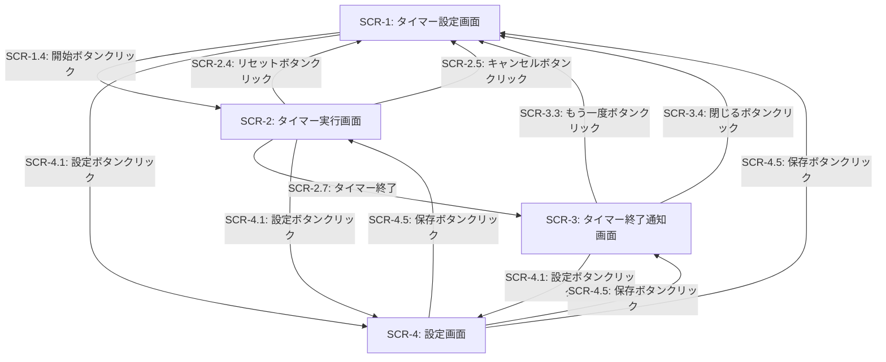
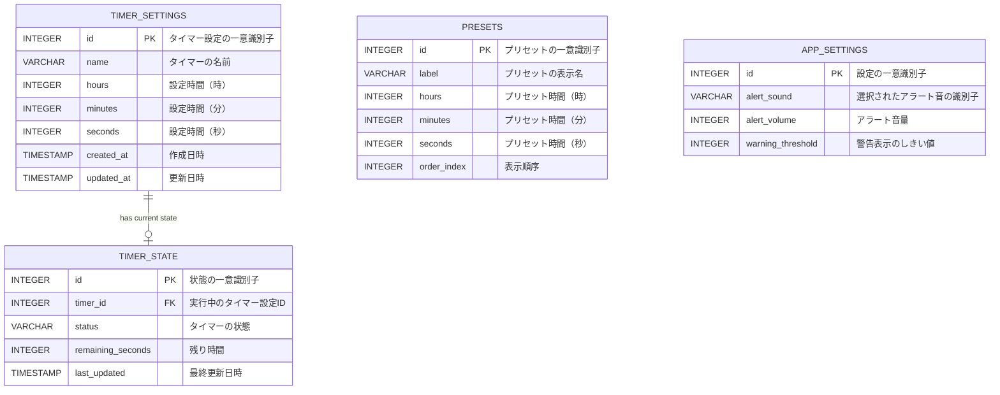

# 外部設計書

## 画面設計

### SCR-1: タイマー設定画面

| イベントID | 条件 | 挙動 | 要件ID | 備考 |
|--------|------|------|--------|------|
| SCR-1.1 | ユーザーが時、分、秒の入力フィールドに数値を入力する | 入力値が検証され、有効な範囲（0-99時間、0-59分、0-59秒）内であることを確認する。不正な値の場合はエラーメッセージを表示する | REQ-1.1 | 最大設定時間は99:59:59 |
| SCR-1.2 | ユーザーがプリセットボタン（5分、10分、25分など）をクリックする | 対応する時間が自動的に入力フィールドに設定される | REQ-1.2 | プリセットは設定画面でカスタマイズ可能 |
| SCR-1.3 | ユーザーがタイマー名入力フィールドにテキストを入力する | 入力されたテキストがタイマーラベルとして表示される | REQ-1.3 | 最大文字数は50文字 |
| SCR-1.4 | ユーザーが「開始」ボタンをクリックする | 入力された時間が有効な場合、タイマー実行画面（SCR-2）に遷移し、カウントダウンが開始される | REQ-2.1 | 時間が未設定または0の場合はエラー表示 |

### SCR-2: タイマー実行画面

| イベントID | 条件 | 挙動 | 要件ID | 備考 |
|--------|------|------|--------|------|
| SCR-2.1 | タイマーが実行中である | 残り時間が1秒ごとに更新され、時:分:秒の形式で表示される。プログレスサークルも進行状況に応じて更新される | REQ-3.1, REQ-3.2 | 1秒ごとに描画更新 |
| SCR-2.2 | ユーザーが「一時停止」ボタンをクリックする | タイマーが一時停止し、ボタンが「再開」に変更される | REQ-2.2 | 一時停止中も残り時間は表示される |
| SCR-2.3 | タイマーが一時停止中で、ユーザーが「再開」ボタンをクリックする | タイマーが一時停止した時点の残り時間から再開される | REQ-2.3 | - |
| SCR-2.4 | ユーザーが「リセット」ボタンをクリックする | 確認ダイアログを表示し、確認後にタイマー設定画面（SCR-1）に戻り、前回の設定値が初期値として表示される | REQ-2.4 | 実行中でも一時停止中でも実行可能 |
| SCR-2.5 | ユーザーが「キャンセル」ボタンをクリックする | 確認ダイアログを表示し、確認後にタイマー設定画面（SCR-1）に戻る | REQ-2.5 | タイマー設定はクリアされる |
| SCR-2.6 | 残り時間が60秒以下になる | 残り時間の表示色が赤色に変更され、警告を視覚的に示す | REQ-3.3 | 色変更のしきい値は設定可能 |
| SCR-2.7 | タイマーが0秒に達する | 音声アラートが再生され、通知画面（SCR-3）に遷移する | REQ-4.1, REQ-4.2 | - |

### SCR-3: タイマー終了通知画面

| イベントID | 条件 | 挙動 | 要件ID | 備考 |
|--------|------|------|--------|------|
| SCR-3.1 | タイマー終了画面が表示される | 「タイマー終了」メッセージとタイマー名が表示され、音声アラートが再生される | REQ-4.1, REQ-4.2 | アラートはループ再生される |
| SCR-3.2 | ユーザーが「停止」ボタンをクリックする | 音声アラートが停止する | REQ-4.3 | - |
| SCR-3.3 | ユーザーが「もう一度」ボタンをクリックする | タイマー設定画面（SCR-1）に戻り、前回と同じ設定値が初期値として表示される | REQ-2.4 | - |
| SCR-3.4 | ユーザーが「閉じる」ボタンをクリックする | タイマー設定画面（SCR-1）に戻る | - | - |

### SCR-4: 設定画面

| イベントID | 条件 | 挙動 | 要件ID | 備考 |
|--------|------|------|--------|------|
| SCR-4.1 | ユーザーが設定ボタンをクリックする | 設定画面が表示される | - | いずれの画面からもアクセス可能 |
| SCR-4.2 | ユーザーがプリセット時間を編集する | 新しいプリセット時間を追加、編集、削除できる | REQ-1.2 | 最大10個まで登録可能 |
| SCR-4.3 | ユーザーがアラート音の種類を選択する | 利用可能なアラート音のリストから選択し、プレビュー再生できる | REQ-4.4 | 5種類のアラート音を用意 |
| SCR-4.4 | ユーザーがアラート音量を調整する | スライダーで音量を0-100%の範囲で調整できる | REQ-4.5 | 調整と同時にプレビュー再生 |
| SCR-4.5 | ユーザーが「保存」ボタンをクリックする | 設定を保存し、元の画面に戻る | - | LocalStorageに保存 |

## 画面遷移図

## データ設計

### DB-1: タイマー設定テーブル (timer_settings)

| カラム名 | データ型 | 制約 | 説明 | 要件ID | 備考 |
|--------|----------|------|------|--------|------|
| id | INTEGER | PRIMARY KEY | タイマー設定の一意識別子 | - | 自動採番 |
| name | VARCHAR(50) | - | タイマーの名前/ラベル | REQ-1.3 | NULL許可 |
| hours | INTEGER | NOT NULL, CHECK(0-99) | 設定時間（時） | REQ-1.1 | デフォルト: 0 |
| minutes | INTEGER | NOT NULL, CHECK(0-59) | 設定時間（分） | REQ-1.1 | デフォルト: 0 |
| seconds | INTEGER | NOT NULL, CHECK(0-59) | 設定時間（秒） | REQ-1.1 | デフォルト: 0 |
| created_at | TIMESTAMP | NOT NULL | 作成日時 | - | 自動設定 |
| updated_at | TIMESTAMP | NOT NULL | 更新日時 | - | 自動更新 |

### DB-2: プリセットテーブル (presets)

| カラム名 | データ型 | 制約 | 説明 | 要件ID | 備考 |
|--------|----------|------|------|--------|------|
| id | INTEGER | PRIMARY KEY | プリセットの一意識別子 | - | 自動採番 |
| label | VARCHAR(30) | NOT NULL | プリセットの表示名 | REQ-1.2 | 例: "ポモドーロ" |
| hours | INTEGER | NOT NULL, CHECK(0-99) | プリセット時間（時） | REQ-1.2 | デフォルト: 0 |
| minutes | INTEGER | NOT NULL, CHECK(0-59) | プリセット時間（分） | REQ-1.2 | デフォルト: 0 |
| seconds | INTEGER | NOT NULL, CHECK(0-59) | プリセット時間（秒） | REQ-1.2 | デフォルト: 0 |
| order_index | INTEGER | NOT NULL | 表示順序 | REQ-1.2 | 0から開始 |

### DB-3: アプリケーション設定テーブル (app_settings)

| カラム名 | データ型 | 制約 | 説明 | 要件ID | 備考 |
|--------|----------|------|------|--------|------|
| id | INTEGER | PRIMARY KEY | 設定の一意識別子 | - | 常に1レコードのみ |
| alert_sound | VARCHAR(50) | NOT NULL | 選択されたアラート音の識別子 | REQ-4.4 | デフォルト: "default" |
| alert_volume | INTEGER | NOT NULL, CHECK(0-100) | アラート音量（0-100%） | REQ-4.5 | デフォルト: 80 |
| warning_threshold | INTEGER | NOT NULL, CHECK(0-3600) | 警告表示のしきい値（秒） | REQ-3.3 | デフォルト: 60 |

### DB-4: タイマー状態テーブル (timer_state)

| カラム名 | データ型 | 制約 | 説明 | 要件ID | 備考 |
|--------|----------|------|------|--------|------|
| id | INTEGER | PRIMARY KEY | 状態の一意識別子 | - | 常に1レコードのみ |
| timer_id | INTEGER | FOREIGN KEY | 実行中のタイマー設定ID | - | timer_settings.id参照 |
| status | VARCHAR(20) | NOT NULL | タイマーの状態 | REQ-2.1, REQ-2.2, REQ-2.3 | 'stopped', 'running', 'paused' |
| remaining_seconds | INTEGER | NOT NULL | 残り時間（秒） | NFR-4.2 | 状態復元用 |
| last_updated | TIMESTAMP | NOT NULL | 最終更新日時 | NFR-4.2 | 状態復元の基準時刻 |

## ER図

## その他設計事項

### ローカルストレージの使用

Webアプリケーションとして実装する場合、バックエンドDBの代わりにブラウザのLocalStorageを使用してデータを永続化する。以下のキーで管理する：

- `countdown_timer_settings`: 最後に使用したタイマー設定
- `countdown_timer_presets`: プリセット一覧
- `countdown_timer_app_settings`: アプリケーション設定
- `countdown_timer_state`: 実行中のタイマー状態（ページリロード時の復元用）

### タイマー精度の確保

NFR-1.1の要件（誤差±0.05秒以内）を満たすため、以下の実装方針を採用する：

- `setInterval`ではなく`requestAnimationFrame`を使用して描画更新
- 基準時刻（開始時刻）からの経過時間を計算することで累積誤差を防止
- Web Workers APIを活用してメインスレッドの負荷によるタイマーの遅延を最小化

### バックグラウンド動作

NFR-4.1の要件（タブ切り替え時の正常動作）を満たすため、以下を実装する：

- Page Visibility APIを使用してタブの非表示化を検知
- タブが再度表示されたタイミングで経過時間を再計算し、残り時間を補正
- タイマー終了時に通知を表示する場合はNotifications APIを使用

### レスポンシブデザイン

NFR-3.2の要件（デスクトップおよびモバイル対応）を満たすため：

- モバイル: 画面全体を使用したシンプルなレイアウト（縦配置）
- タブレット/デスクトップ: より大きなフォントと余白を持つレイアウト
- タッチデバイス向けに十分なタッチターゲットサイズ（最小44x44px）を確保

### アクセシビリティ

NFR-2.1、NFR-2.2の要件を満たすため：

- セマンティックHTMLとARIA属性の適切な使用
- キーボードナビゲーションのサポート（Space: 開始/一時停止、R: リセット、Esc: キャンセル）
- スクリーンリーダー対応（残り時間の読み上げ、状態変化の通知）
- 色のみに依存しない情報伝達（警告時はアイコンも表示）
