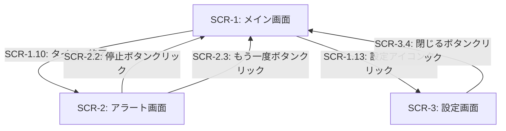

# 外部設計書

## 画面設計

### SCR-1: メイン画面（タイマー画面）

| イベントID | 条件 | 挙動 | 要件ID | 備考 |
|--------|------|------|--------|------|
| SCR-1.1 | 初期表示時 | 時間入力フィールド（時:分:秒）とプリセットボタン、制御ボタンを表示する。残り時間表示エリアは「00:00:00」を表示 | REQ-1.1, REQ-3.1, NFR-2.1 | |
| SCR-1.2 | ユーザーが時間入力フィールドに値を入力した | 入力値をバリデーションし、有効な場合は開始ボタンを有効化する | REQ-1.1 | 最大値は99:59:59 |
| SCR-1.3 | ユーザーがプリセットボタンをクリックした | 選択したプリセット時間を入力フィールドに反映し、開始ボタンを有効化する | REQ-1.2 | 5分、10分、25分などのプリセット |
| SCR-1.4 | ユーザーが「開始」ボタンをクリックした | タイマーを開始し、残り時間のカウントダウン表示を開始する。進行状況インジケーターを表示する | REQ-2.1, REQ-3.1, REQ-3.2 | 開始ボタンは「一時停止」ボタンに変化 |
| SCR-1.5 | タイマー実行中に「一時停止」ボタンをクリックした | カウントダウンを一時停止し、現在の残り時間を維持する | REQ-2.2 | 一時停止ボタンは「再開」ボタンに変化 |
| SCR-1.6 | 一時停止中に「再開」ボタンをクリックした | 一時停止した時点の残り時間からカウントダウンを再開する | REQ-2.3 | 再開ボタンは「一時停止」ボタンに変化 |
| SCR-1.7 | タイマー実行中または一時停止中に「リセット」ボタンをクリックした | タイマーを停止し、入力した初期値に残り時間を戻す | REQ-2.4 | |
| SCR-1.8 | タイマー実行中に「キャンセル」ボタンをクリックした | タイマーを停止し、初期状態（時間未設定）に戻す | REQ-2.5 | |
| SCR-1.9 | 残り時間が1分以下になった | 残り時間の表示色を赤色に変更して警告を示す | REQ-3.3 | |
| SCR-1.10 | カウントダウンが0に達した | アラート画面（SCR-2）に遷移する | REQ-4.1, REQ-4.2 | |
| SCR-1.11 | ブラウザタブを切り替えた | バックグラウンドでタイマーが継続動作する | NFR-4.1 | |
| SCR-1.12 | ページをリロードした | タイマー状態を復元し、カウントダウンを継続する | NFR-4.2 | LocalStorageを使用 |
| SCR-1.13 | ユーザーが設定アイコンをクリックした | 設定画面（SCR-3）に遷移する | REQ-4.4, REQ-4.5 | |

### SCR-2: アラート画面

| イベントID | 条件 | 挙動 | 要件ID | 備考 |
|--------|------|------|--------|------|
| SCR-2.1 | アラート画面表示時 | 音声アラートを再生し、「タイマー終了」メッセージを表示する | REQ-4.1, REQ-4.2 | |
| SCR-2.2 | ユーザーが「停止」ボタンをクリックした | アラート音を停止し、メイン画面（SCR-1）の初期状態に遷移する | REQ-4.3 | |
| SCR-2.3 | ユーザーが「もう一度」ボタンをクリックした | アラート音を停止し、同じ設定時間でタイマーを再開する（SCR-1でタイマー実行中の状態へ） | REQ-4.3, REQ-2.4 | |

### SCR-3: 設定画面

| イベントID | 条件 | 挙動 | 要件ID | 備考 |
|--------|------|------|--------|------|
| SCR-3.1 | 設定画面表示時 | 現在のアラート音設定と音量設定を表示する | REQ-4.4, REQ-4.5 | |
| SCR-3.2 | ユーザーがアラート音を選択した | 選択したアラート音のプレビューを再生し、設定を保存する | REQ-4.4 | |
| SCR-3.3 | ユーザーが音量スライダーを調整した | 音量設定を変更し、保存する | REQ-4.5 | 0〜100%の範囲 |
| SCR-3.4 | ユーザーが「閉じる」ボタンまたは画面外をクリックした | 設定画面を閉じてメイン画面（SCR-1）に戻る | | |

## 画面遷移図

## その他設計事項

### データ永続化

タイマー状態の永続化にはブラウザのLocalStorageを使用する。保存するデータは以下の通り：

| 項目 | データ型 | 説明 | 要件ID |
|------|----------|------|--------|
| initialTime | number | 設定した初期時間（秒） | NFR-4.2 |
| remainingTime | number | 残り時間（秒） | NFR-4.2 |
| timerState | string | タイマーの状態（idle / running / paused） | NFR-4.2 |
| lastUpdated | number | 最終更新時刻（タイムスタンプ） | NFR-4.2 |
| alarmSoundType | string | 選択されたアラート音の種類 | REQ-4.4 |
| alarmVolume | number | アラート音量（0-100） | REQ-4.5 |

### キーボードショートカット

| ショートカット | 機能 | 要件ID |
|---------------|------|--------|
| Space | タイマーの開始/一時停止/再開 | NFR-2.3 |
| Escape | タイマーのキャンセル / アラートの停止 | NFR-2.3 |
| R | タイマーのリセット | NFR-2.3 |

### レスポンシブ対応

| 画面サイズ | レイアウト | 要件ID |
|-----------|-----------|--------|
| デスクトップ（768px以上） | 横並びレイアウト、大きな時間表示 | NFR-3.2 |
| モバイル（768px未満） | 縦並びレイアウト、タッチ操作に適したボタンサイズ | NFR-3.2, NFR-2.2 |

### プリセット時間の初期値

| プリセット名 | 時間 | 要件ID |
|-------------|------|--------|
| 5分 | 5:00 | REQ-1.2 |
| 10分 | 10:00 | REQ-1.2 |
| 15分 | 15:00 | REQ-1.2 |
| 25分 | 25:00 | REQ-1.2 |
| 30分 | 30:00 | REQ-1.2 |
| 60分 | 60:00 | REQ-1.2 |
