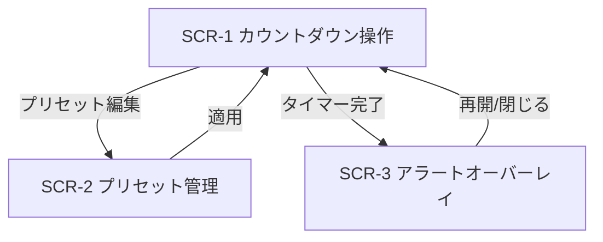
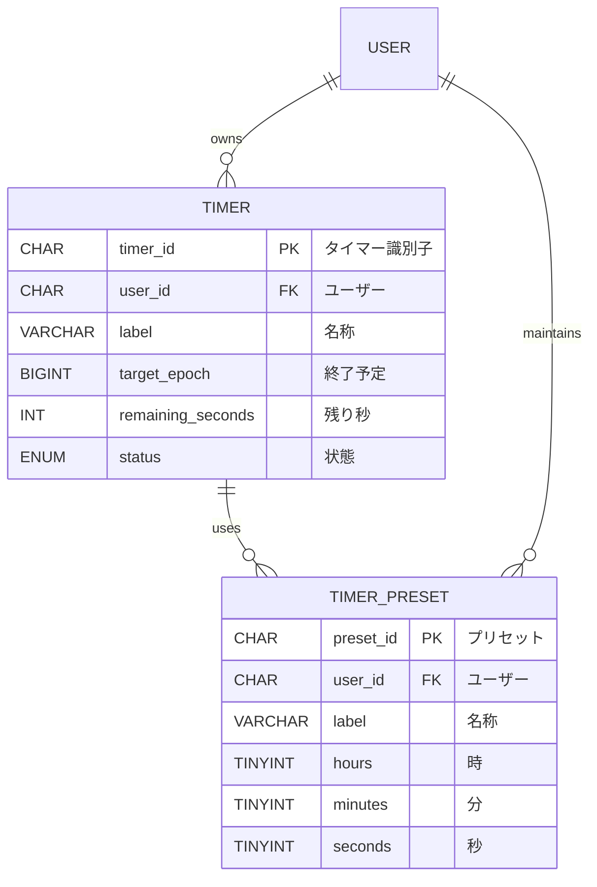

# 外部設計書

※ 本書は `docs/specs/countdown-timer/requirements.md` の要件に基づき、必要な項目のみを整理した外部設計である。

## 画面設計

### SCR-1: カウントダウン操作画面

| イベントID | 条件 | 挙動 | 要件ID | 備考 |
|--------|------|------|--------|------|
| SCR-1.1 | ユーザーが時・分・秒入力欄を編集する | 0~99:59:59の範囲と整数値をリアルタイム検証し、無効値はエラー表示と開始ボタンを無効化する | REQ-1.1, NFR-2.1 | IMEオフ・数値キーパッドを要求 |
| SCR-1.2 | プリセットドロップダウンを開く | 登録済みプリセットを一覧表示し、選択すると入力欄へ即時反映する | REQ-1.2 | 上限10件、最新順 |
| SCR-1.3 | タイマー名入力欄を編集する | ラベルを最大32文字で保存し、履歴にバインドする | REQ-1.3 | 未入力時はデフォルト名を付与 |
| SCR-1.4 | 開始ボタンをタップ | 入力値をロックし、カウントダウンと円形プログレスバー更新を開始する | REQ-2.1, REQ-3.2 | 1/60秒で描画、開始時にアラート設定を記録 |
| SCR-1.5 | 一時停止ボタンをタップ | 残り時間を凍結し、再開ボタンを強調表示する | REQ-2.2 | 一時停止回数は制限なし |
| SCR-1.6 | 再開ボタンをタップ | 停止時点の秒数から再開し、ボタンラベルを「一時停止」に戻す | REQ-2.3 | 背景処理中も同期 |
| SCR-1.7 | リセットボタンをタップ | 残り時間とプログレスを初期値へ戻し、入力欄を再編集可能にする | REQ-2.4 | 進行中/停止中どちらでも可 |
| SCR-1.8 | キャンセルボタンをタップ | タイマーを終了し状態をクリア、通知を発火させない | REQ-2.5 | キャンセル時は履歴に残さない |
| SCR-1.9 | 残り1分を下回る | 残り時間ラベルとプログレスを警告色に変更し、アニメーションで注意喚起する | REQ-3.3 | 閾値は設定で変更可能 |
| SCR-1.10 | タイマーが0になる | フルスクリーンのアラートカードを表示し、選択した音声をループ再生する | REQ-4.1, REQ-4.2 | ループは最大60秒 |
| SCR-1.11 | アラートの停止ボタンを押下 | 音声とバイブレーションを即時停止し、カードを閉じる | REQ-4.3 | ショートカットキーにも対応 |
| SCR-1.12 | サウンド設定パネルを開く | プルダウンで音色選択、スライダーで音量調整しプレビューを再生する | REQ-4.4, REQ-4.5 | 設定はユーザーごとに永続化 |

### SCR-2: プリセット管理モーダル

| イベントID | 条件 | 挙動 | 要件ID | 備考 |
|--------|------|------|--------|------|
| SCR-2.1 | 「プリセットを編集」リンクをクリック | モーダルを開き、既存プリセットをリスト表示する | REQ-1.2 | 並び替えはドラッグ対応 |
| SCR-2.2 | 新規プリセットを追加 | 時間と名称を入力し保存するとリストへ追記、即時本体画面へ反映 | REQ-1.2 | 同名重複は警告 |
| SCR-2.3 | プリセットを削除 | ゴミ箱操作で対象を削除し、元に戻すトーストを表示 | REQ-1.2 | 5秒以内にUndo可能 |
| SCR-2.4 | プリセットを適用 | 行の「適用」操作でモーダルを閉じ、本体入力欄へ転記 | REQ-1.2 | 適用時に開始まではしない |

### SCR-3: アラート詳細オーバーレイ

| イベントID | 条件 | 挙動 | 要件ID | 備考 |
|--------|------|------|--------|------|
| SCR-3.1 | タイマー完了後に「詳細」ボタンを押下 | 終了理由、経過時間、次に開始するプリセットを提示する | REQ-4.2 | モーダルで履歴リンクを表示 |
| SCR-3.2 | 「同じ設定で再開」を選択 | 同一値で再スタートし、オーバーレイを閉じる | REQ-2.4 | ポモドーロサイクル用 |

## 画面遷移図

## API設計

### API-1: タイマーセッションAPI

| インタフェースID | メソッド | エンドポイント | パラメータ | レスポンス | 要件ID | 備考 |
|--------|----------|----------------|------------|------------|--------|------|
| API-1.1 | POST | /api/v1/timers | body: label(string), totalSeconds(int), soundKey(string), volume(int), presetId(string\|null) | 201 Created: {timerId, expiresAt} | REQ-1.1, REQ-4.4, REQ-4.5, NFR-4.2 | サーバ時間で終了時刻を算出し復元に利用 |
| API-1.2 | PATCH | /api/v1/timers/{timerId} | body: status(enum:start|pause|cancel), remainingSeconds(int) | 200 OK: {status, remainingSeconds} | REQ-2.2, REQ-2.3, REQ-2.5, NFR-4.1 | 状態遷移を一元管理し多端末同期 |
| API-1.3 | GET | /api/v1/timers/{timerId} | path: timerId | 200 OK: {label, status, targetTime, remainingSeconds} | REQ-2.4, NFR-4.2 | リロード復元用 |

### API-2: プリセットAPI

| インタフェースID | メソッド | エンドポイント | パラメータ | レスポンス | 要件ID | 備考 |
|--------|----------|----------------|------------|------------|--------|------|
| API-2.1 | GET | /api/v1/presets | query: limit(int<=20) | 200 OK: [{presetId, label, hours, minutes, seconds, soundKey, volume}] | REQ-1.2, REQ-4.4, REQ-4.5 | ユーザー単位のスコープ |
| API-2.2 | POST | /api/v1/presets | body: label(string), hours(int), minutes(int), seconds(int), soundKey(string), volume(int) | 201 Created: {presetId} | REQ-1.2 | 作成と同時に並び順末尾へ |
| API-2.3 | DELETE | /api/v1/presets/{presetId} | path: presetId | 204 No Content | REQ-1.2 | Undoはクライアントで保持 |

## データ設計

### DB-1: timers テーブル

| カラム名 | データ型 | 制約 | 説明 | 要件ID | 備考 |
|--------|----------|------|------|--------|------|
| timer_id | CHAR(26) | PRIMARY KEY | タイマー識別子 | REQ-2.1 | ULID採用 |
| user_id | CHAR(26) | NOT NULL | 所有ユーザー | NFR-4.2 | 匿名時はデバイスID |
| label | VARCHAR(32) | NOT NULL | タイマー名称 | REQ-1.3 | |
| target_epoch | BIGINT | NOT NULL | 終了予定UTC時刻(ms) | REQ-2.1 | |
| remaining_seconds | INT | NOT NULL | 現在の残り秒数 | REQ-2.2, REQ-2.3 | |
| status | ENUM('ready','running','paused','finished','canceled') | NOT NULL | 状態管理 | REQ-2.5 | |
| sound_key | VARCHAR(32) | NOT NULL | アラート音種別 | REQ-4.4 | |
| volume | TINYINT | NOT NULL | 0-100の音量 | REQ-4.5 | |
| last_paused_at | BIGINT | NULL | 最終一時停止時刻 | REQ-2.2 | |
| created_at | TIMESTAMP | NOT NULL | 作成日時 | NFR-4.2 | |
| updated_at | TIMESTAMP | NOT NULL | 更新日時 | NFR-4.2 | |

### DB-2: timer_presets テーブル

| カラム名 | データ型 | 制約 | 説明 | 要件ID | 備考 |
|--------|----------|------|------|--------|------|
| preset_id | CHAR(26) | PRIMARY KEY | プリセット識別子 | REQ-1.2 | |
| user_id | CHAR(26) | NOT NULL | 所有ユーザー | REQ-1.2 | |
| label | VARCHAR(32) | NOT NULL | プリセット名 | REQ-1.2 | |
| hours | TINYINT | NOT NULL | 時 | REQ-1.1 | 0-99 |
| minutes | TINYINT | NOT NULL | 分 | REQ-1.1 | 0-59 |
| seconds | TINYINT | NOT NULL | 秒 | REQ-1.1 | 0-59 |
| sound_key | VARCHAR(32) | NOT NULL | 既定アラート音 | REQ-4.4 | |
| volume | TINYINT | NOT NULL | 既定音量 | REQ-4.5 | |
| sort_order | SMALLINT | NOT NULL | 表示順序 | REQ-1.2 | 0始まり |
| created_at | TIMESTAMP | NOT NULL | 生成日時 | NFR-4.2 | |
| updated_at | TIMESTAMP | NOT NULL | 更新日時 | NFR-4.2 | |

## ER図

## その他設計事項

* 精度要件 (NFR-1.1) を満たすため、内部クロックは`performance.now()`とService Workerで二重計測し、描画は`requestAnimationFrame`に集約する。
* UI応答 (NFR-1.2, NFR-2.1) を確保するため、音声プレビューや保存処理はWeb Worker経由で非同期化する。
* クロスブラウザ互換 (NFR-3.1) とレスポンシブ (NFR-3.2) を達成するため、CSSカスタムプロパティとコンテナクエリでボタンサイズ・レイアウトを調整する。
* バックグラウンド耐性と復元 (NFR-4.1, NFR-4.2) は、`localStorage`/IndexedDBへ直近のtimerIdを保存し、復帰時にAPI-1.3で最新状態を同期する。
* キーボードショートカット (NFR-2.3) とアクセシビリティは、ARIAロール設定およびタブ順制御で補完する。
